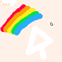

# [mousep8](https://binglecringle180.github.io/mousep8/)
\
test program for the mouse\
(this has a krillion shortcuts in it so beware)\
```
left to draw
right to set col to 0 (erase)
middle to erase all
hold ❎ and left to set bg
🅾️ to undo
❎ and 🅾️ to undo last size steps
❎ and ⬆️/⬇️ to change size by 5
tab to increment layer
❎ and tab to decrement
hold q to only show current layer